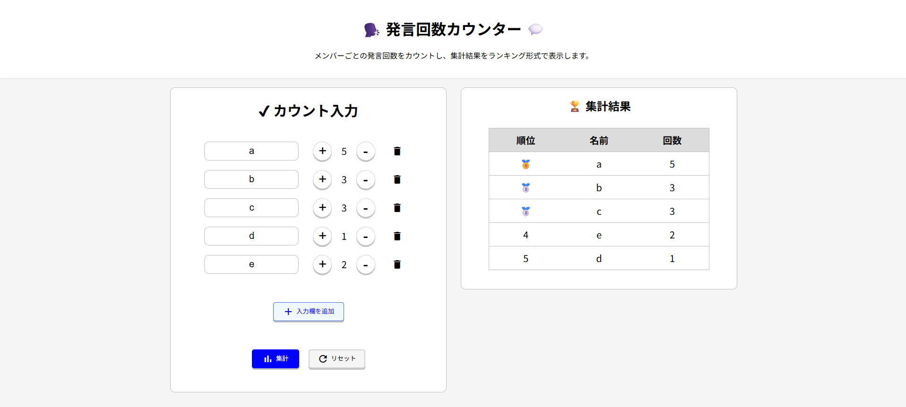

# 🗣️ Speaker Counter

ミーティングやグループワークで、メンバーごとの発言回数を簡単に記録・集計できるWebアプリケーションです。

発言回数を+-ボタンを用いてカウントし、集計ボタンを押すだけでランキング形式で結果を表示します。議論への参加状況を可視化し、発言の偏りを把握することを目的として制作しました。

---

## 主な機能

* メンバーの入力欄を自由に追加・削除
* ボタン操作による発言回数のカウント
* 発言回数順のランキング表示
* 同率順位に対応したランキング
* 🥇🥈🥉による上位3位の表示
* 入力内容をまとめてリセット
* PC・スマートフォン両対応のレスポンシブデザイン

---

## 画面イメージ



---

## デモ

GitHub Pages

https://harukahida.github.io/SpeakerCounter/

---

## 使用技術

* HTML5
* CSS3

  * Flexbox
  * Media Query
* JavaScript (Vanilla JS)
* Google Material Icons

---

## 💡 工夫したポイント

### レスポンシブデザイン

PCでは入力画面と集計結果を左右2カラムで表示し、スマートフォンでは縦1カラムへ自動で切り替わるレイアウトを採用しました。画面サイズに応じて見やすく操作しやすいUIを実現しています。

### 操作ミスを防ぐUI

カウントが0のときはマイナスボタンを自動的に無効化し、負の値になることを防止しています。また、新しい入力欄を追加すると自動でカーソルが移動するため、キーボードだけでスムーズに入力できます。

### 同率順位への対応

集計結果は発言回数の降順でソートし、同じ回数の場合は同じ順位を表示するよう実装しました。順位のずれが発生しないランキングアルゴリズムを作成しています。

---

## 🔥 苦労した点

入力欄を追加・削除できる仕様のため、削除後に新しい入力欄を追加するとIDが重複し、ボタン操作や集計結果が正しく動作しない問題が発生しました。

そこで、

* 削除しても番号が重複しないグローバルカウンターを導入
* 集計時にはIDではなく画面上のDOM要素を直接取得する方式へ変更

という設計に変更しました。
これにより、入力欄を何度追加・削除しても安定して動作するようになりました。

---

## セットアップ

```bash
git clone https://github.com/ユーザー名/SpeakerCounter.git
```

リポジトリをダウンロード後、`index.html` をブラウザで開くだけで利用できます。

---

## ディレクトリ構成

```text
SpeakerCounter/
├── index.html
├── style.css
├── count.js
├── README.md
├── LICENSE
└── SpeakerCounter_image.png
```

---

## 今後追加したい機能

* 発言割合のグラフ表示
* CSV形式で結果をダウンロード
* 発言履歴の保存
* チャットアプリケーションとの連携

---

## ライセンス

MIT License
